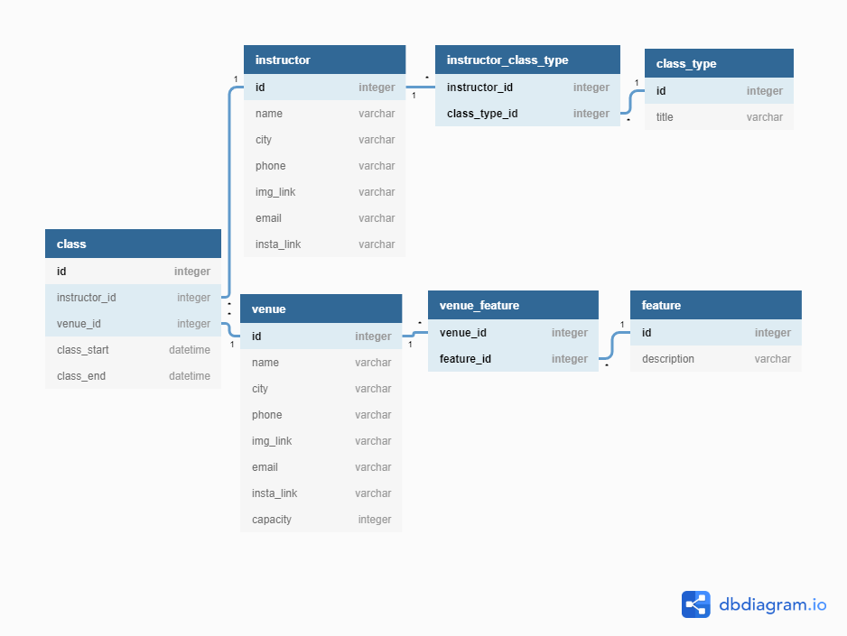

# Yogabook 🧘
Yogabook is a fitness class venue and yoga instructor booking site that enables the discovery and booking of classes between independent instructors and venues.

## Technologies
* SQLAlchemy ORM
* PostgreSQL
* Python | Flask
* HTML
* CSS
* JavaScript

## Database Schema
The relationships between venues and yoga instructors is modelled below.


## Scripts
1. Create app

``` export FLASK_APP=yogabook ```

2. Set development environment

``` export FLASK_ENV=development ```

3. Seed the database

``` flask seed seed ```

4. Clear the database

``` flask seed clear ```

5. Make migrations

``` flask db migrate ```

6. Upgrade database

``` flask db upgrade ```

7. Start project

``` flask run ```
